 

[管理员](http://xiongsihao.com/blog/37#)

 

 2020-03-21  22:40:36

 

 562


## 网站接入QQ登录


https://github.com/xiongsihao/springBoot_demo 源码下载地址

## 前提

1. 拥有自己的域名和服务器
2. 域名已备案

## 登录成功效果

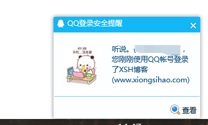

获取信息展示：

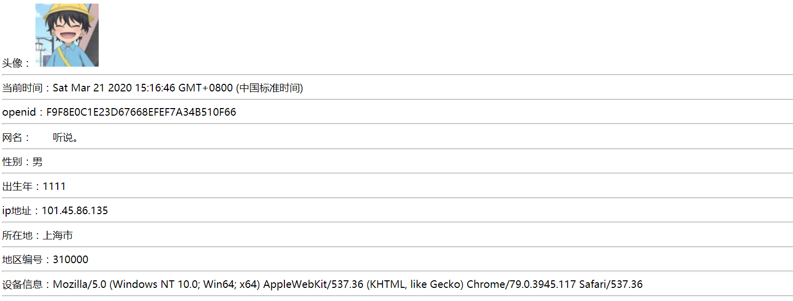

# 一. 关于第三方登录

#### 简要介绍

第三方登录：用户登录操作不是基于自身建设账号体系，而是基于用户在第三方平台上已有的账号和密码来快速完成登录的过程。 下面我列举了几点第三方登录的优点。

1. 极大的简化登录注册的流程。
2. 方便用户快捷登录，降低用户的登录流失率，第三方大厂的用户某种意义上都可以是你用户。传统的登录注册，如果网站较小或者用户不经常使用，可能时间长了，用户就把登录的用户名和密码忘记了。
3. 第三方登录接入后，应用可直接获取用户昵称、头像、用户ID等信息，方便产品获取用户的基本资料。

#### 第三方登录有哪些

- 国内比较广泛使用的第三方登录方式为微博、微信、QQ，天翼账号等。
- 国外广泛使用的登录方式为Facebook，Twitter等。

# 二. QQ登录准备

[官方文档](https://wiki.connect.qq.com/)

## 2.1 注册认证成为开发者

开发者通过以下几个步骤，即可接入互联开放平台： 注册开发者→创建应用→通过审核并获取接口权限

（1）进入[QQ互联官网](https://connect.qq.com/index.html)，点击右上角的“登录”按钮，使用QQ帐号登录，如下图所示：

重要提示：开发者QQ号码一旦注册不能变更

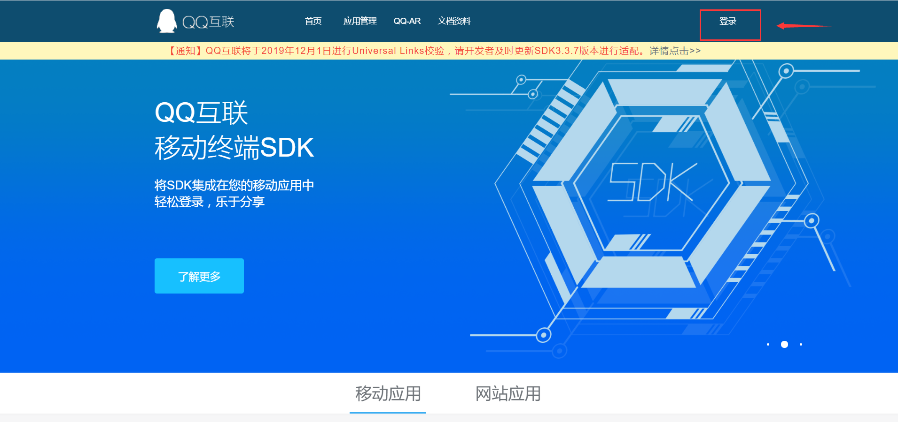

（2）登录成功后点击应用管理，会跳转到开发者注册页面

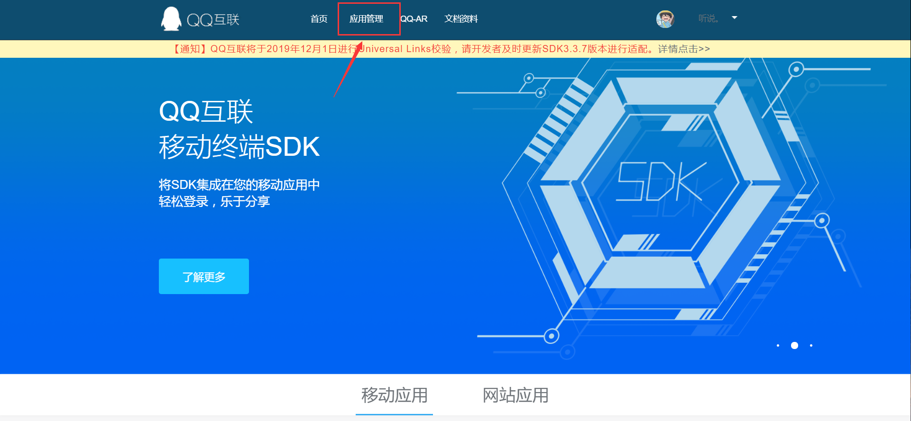

开发者注册页面：

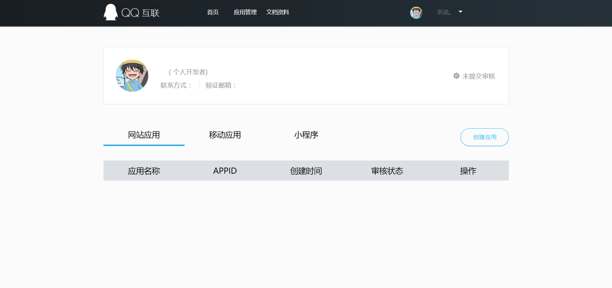

此时状态为未提交审核，点击创建应用会提示：

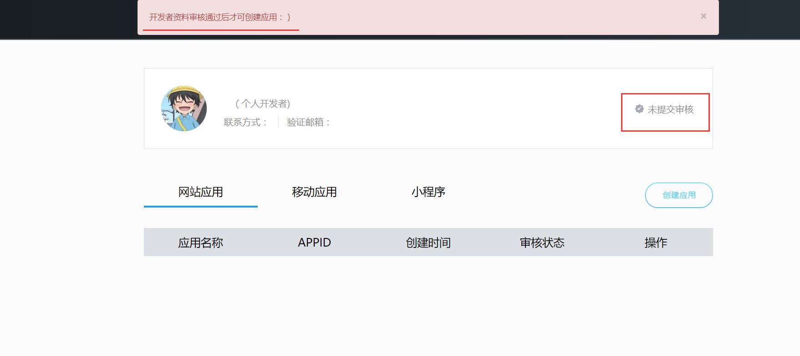

（3）认证开发者：点击右上角QQ头像，进入资料填写页面

公司选择公司接入：

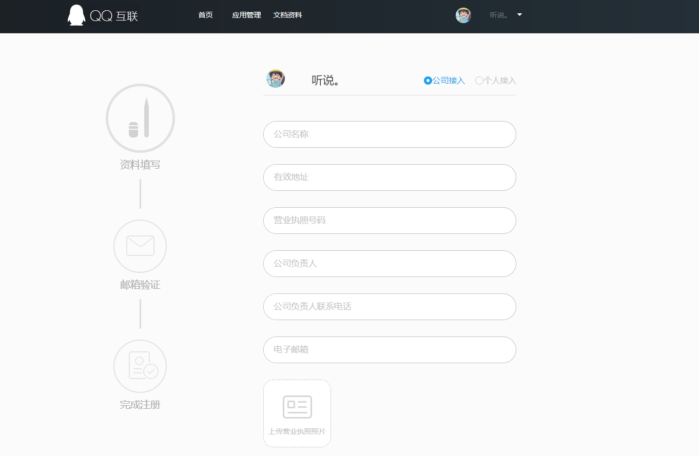

个人则选择个人接入：

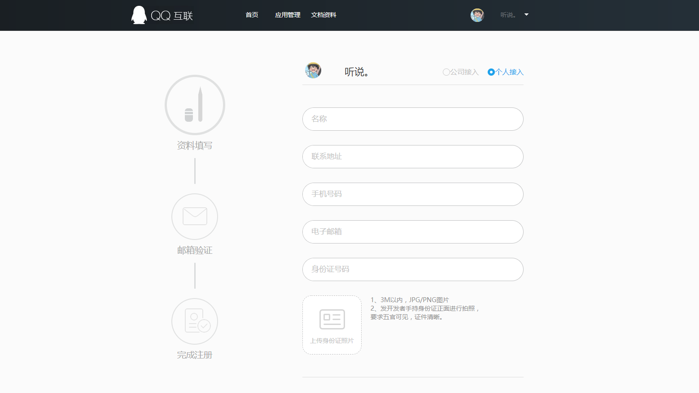

（4）按要求填写资料并提交后，审核人员会进行审核，通过审核即可成为开发者。

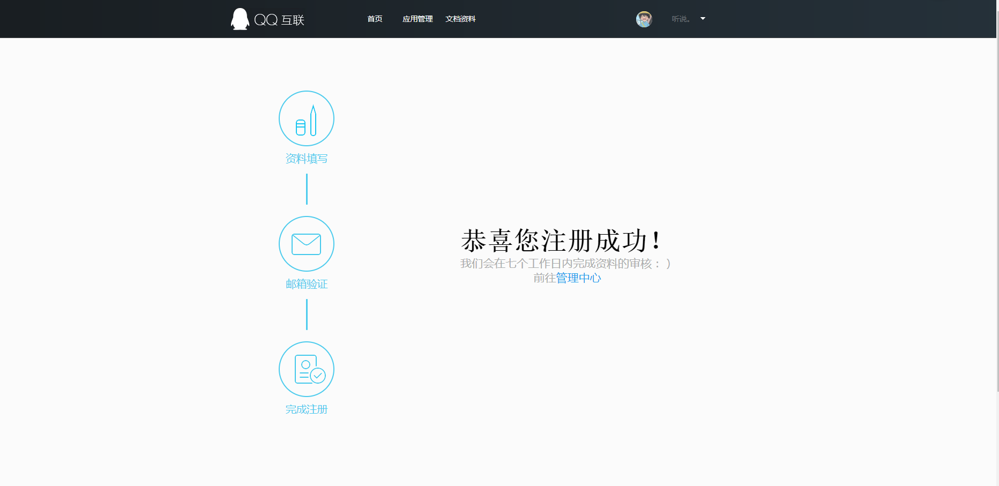

（5）审核通过后收到邮件

腾讯审核很快，当天提交审核当天就能通过

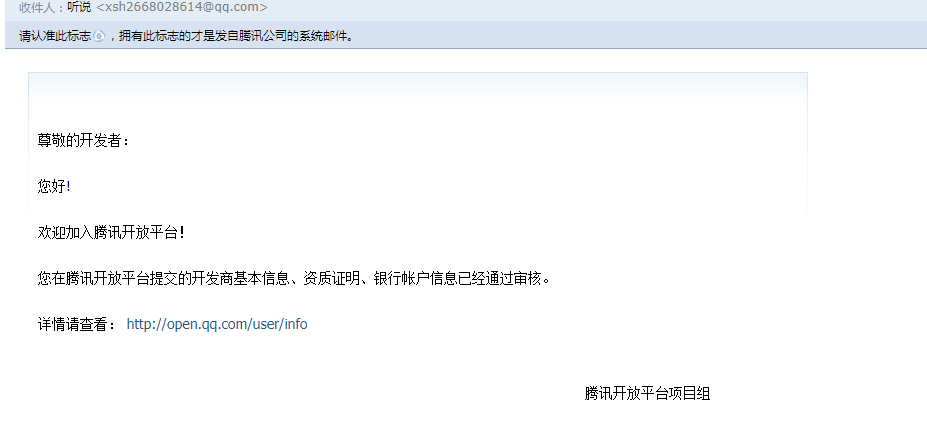

## 2.2 创建应用

进入[QQ互联官网](https://connect.qq.com/index.html)，点击应用管理，此时认证状态已变为审核已通过，可以开始创建应用了

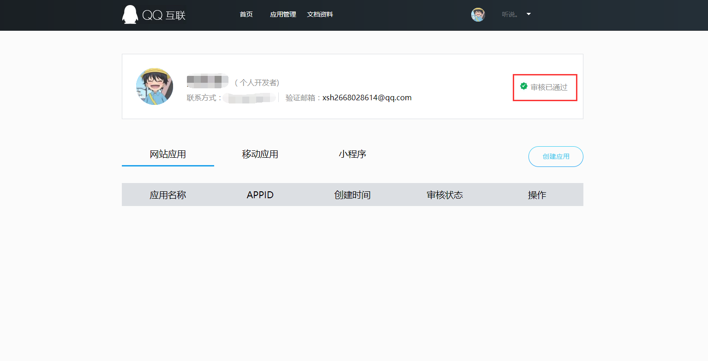

点击创建应用按钮，自行选择网站应用及移动应用接入申请

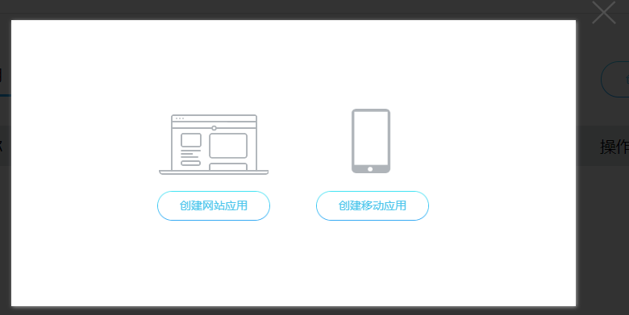

填写完资料后点击创建应用：

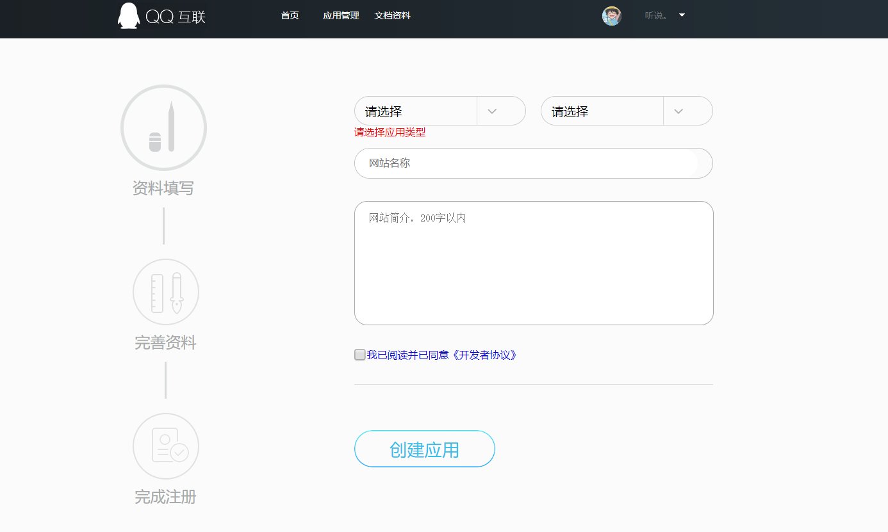

随后进入第二个资料填写页面：

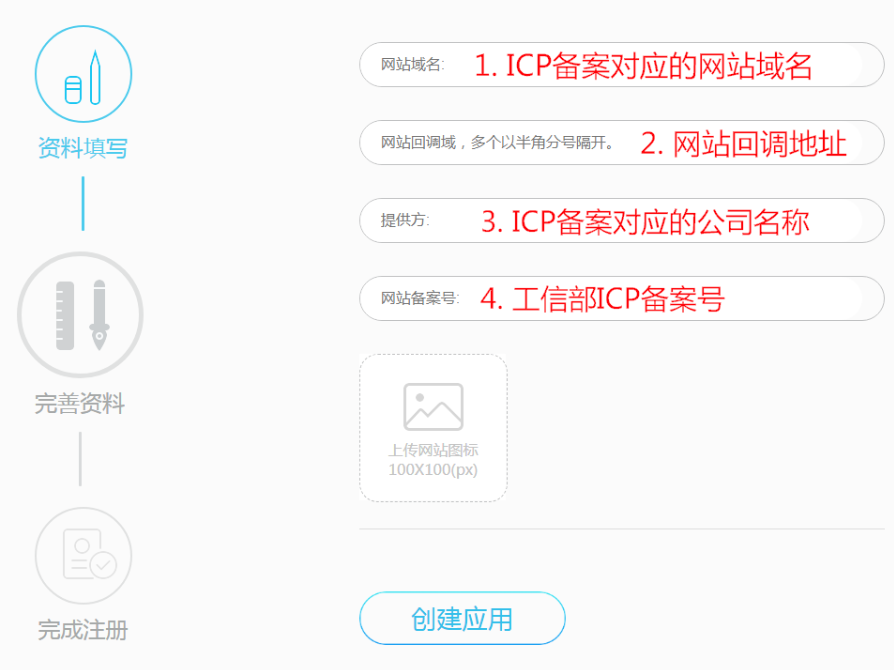

- 网站域名：格式须以http或者https开头。例：http://www.xiongsihao.com
- 网站回调域：官方解答：[回调地址常见问题](https://wiki.connect.qq.com/回调地址常见问题及修改方法)。例：http://xiongsihao.com/qq/callback
- 提供方：打开http://icp.chinaz.com/，选择网站备案输入域名查询，将其中的主办单位名称填入
- 网站备案号：网站域名的ICP备案号。例：赣ICP备20000310号

**备注：创建移动应用与网站应用步骤方法一致。**

**网站应用审核通过后，再修改“网站回调域”，不用再审核。修改其它信息需再次提交审核。**

所以第一次提交审核如不确定网站回调域，可以随便填写一个地址，待审核通过后自行修改。

## 2.3 等待应用审核通过

按照2.2 创建应用的步骤做完后，提交资料需等待审核通过

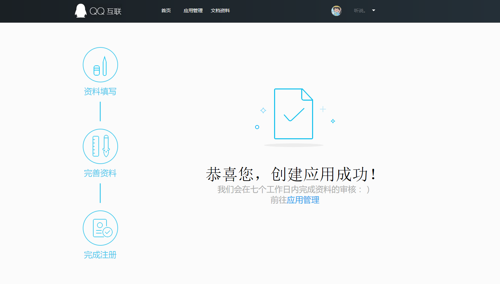

审核时间一般为1天左右，通过后可以开始用代码接入QQ第三方登录了！

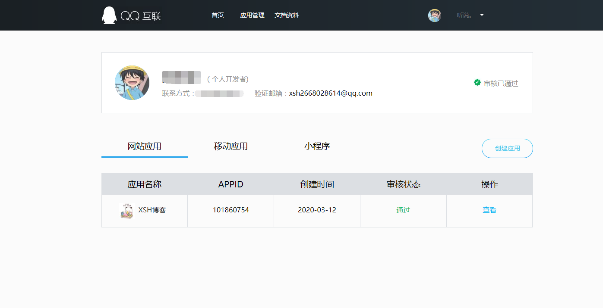

# 三. 网站接入第三方登录

[无github点此下载](http://netdisk.xiongsihao.com/externalLinksController/chain/QQ_Login.zip?ckey=JpZcuzl26MC8427GNik9npL6DLLTQgSK3DazYWiRr3kix1L6m8GGcZwPUa670P7x)

**接入QQ登录的三个重要参数：(1)APP ID，(2)APP Key，(3)网站回调域**

查看应用，记录appid和appkey：

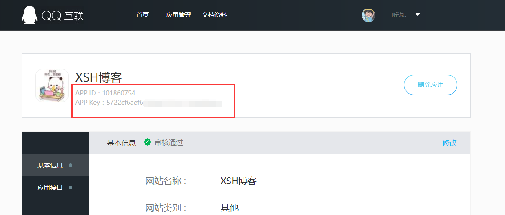

网站回调域为提交审核时填写的地址，在基本信息内可以查看，也可以随意修改

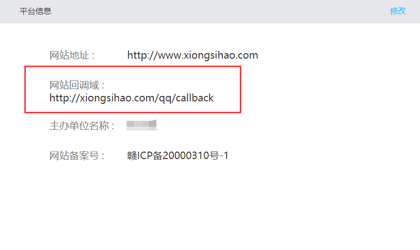

新建一个maven工程：

## 3.1 pom.xml

引入依赖

```xml
<?xml version="1.0" encoding="UTF-8"?>
<project xmlns="http://maven.apache.org/POM/4.0.0"
         xmlns:xsi="http://www.w3.org/2001/XMLSchema-instance"
         xsi:schemaLocation="http://maven.apache.org/POM/4.0.0 http://maven.apache.org/xsd/maven-4.0.0.xsd">
    <modelVersion>4.0.0</modelVersion>
    <parent>
        <groupId>org.springframework.boot</groupId>
        <artifactId>spring-boot-starter-parent</artifactId>
        <version>2.1.5.RELEASE</version>
        <relativePath/> <!-- lookup parent from repository -->
    </parent>

    <groupId>com.xsh</groupId>
    <artifactId>QQ_Login</artifactId>
    <version>1.0-SNAPSHOT</version>
    <packaging>war</packaging>

    <properties>
        <java.version>1.8</java.version>
    </properties>

    <dependencies>
        <dependency>
            <groupId>org.springframework.boot</groupId>
            <artifactId>spring-boot-starter-thymeleaf</artifactId>
        </dependency>
        <dependency>
            <groupId>org.springframework.boot</groupId>
            <artifactId>spring-boot-starter-web</artifactId>
        </dependency>

        <!--httpclient-->
        <dependency>
            <groupId>org.apache.httpcomponents</groupId>
            <artifactId>httpclient</artifactId>
            <version>4.5.6</version>
        </dependency>
        <!--阿里 JSON，用于解析QQ回调信息-->
        <dependency>
            <groupId>com.alibaba</groupId>
            <artifactId>fastjson</artifactId>
            <version>1.2.47</version>
        </dependency>

        <!--QQSDK-->
        <dependency>
            <groupId>net.gplatform</groupId>
            <artifactId>Sdk4J</artifactId>
            <version>2.0</version>
        </dependency>
    </dependencies>

</project>
```

## 3.2 QQHttpClient

```java
package com.xsh.utils;

import com.alibaba.fastjson.JSONObject;
import org.apache.http.HttpEntity;
import org.apache.http.HttpResponse;
import org.apache.http.client.methods.HttpGet;
import org.apache.http.impl.client.CloseableHttpClient;
import org.apache.http.impl.client.HttpClients;
import org.apache.http.util.EntityUtils;

import java.io.IOException;

/**
 * @author xsh
 * @create 2020-03-13 20:45
 * QQ工具类（主要用于解析QQ返回的信息）
 */
public class QQHttpClient {

    private static JSONObject parseJSONP(String jsonp){
        int startIndex = jsonp.indexOf("(");
        int endIndex = jsonp.lastIndexOf(")");

        String json = jsonp.substring(startIndex + 1,endIndex);

        return JSONObject.parseObject(json);
    }
    //qq返回信息：access_token=FE04************************CCE2&expires_in=7776000&refresh_token=88E4************************BE14
    public static String getAccessToken(String url) throws IOException {
        CloseableHttpClient client = HttpClients.createDefault();
        String token = null;

        HttpGet httpGet = new HttpGet(url);
        HttpResponse response = client.execute(httpGet);
        HttpEntity entity = response.getEntity();

        if(entity != null){
            String result = EntityUtils.toString(entity,"UTF-8");
            if(result.indexOf("access_token") >= 0){
                String[] array = result.split("&");
                for (String str : array){
                    if(str.indexOf("access_token") >= 0){
                        token = str.substring(str.indexOf("=") + 1);
                        break;
                    }
                }
            }
        }

        httpGet.releaseConnection();
        return token;
    }
    //qq返回信息：callback( {"client_id":"YOUR_APPID","openid":"YOUR_OPENID"} ); 需要用到上面自己定义的解析方法parseJSONP
    public static String getOpenID(String url) throws IOException {
        JSONObject jsonObject = null;
        CloseableHttpClient client = HttpClients.createDefault();

        HttpGet httpGet = new HttpGet(url);
        HttpResponse response = client.execute(httpGet);
        HttpEntity entity = response.getEntity();

        if(entity != null){
            String result = EntityUtils.toString(entity,"UTF-8");
            jsonObject = parseJSONP(result);
        }

        httpGet.releaseConnection();

        if(jsonObject != null){
            return jsonObject.getString("openid");
        }else {
            return null;
        }
    }

    //qq返回信息：{ "ret":0, "msg":"", "nickname":"YOUR_NICK_NAME", ... }，为JSON格式，直接使用JSONObject对象解析
    public static JSONObject getUserInfo(String url) throws IOException {
        JSONObject jsonObject = null;
        CloseableHttpClient client = HttpClients.createDefault();

        HttpGet httpGet = new HttpGet(url);
        HttpResponse response = client.execute(httpGet);
        HttpEntity entity = response.getEntity();


        if(entity != null){
            String result = EntityUtils.toString(entity,"UTF-8");
            jsonObject = JSONObject.parseObject(result);
        }

        httpGet.releaseConnection();

        return jsonObject;
    }
}
```

## 3.3 Controller

**QQController**

```java
package com.xsh.controller;

import com.alibaba.fastjson.JSONObject;
import com.xsh.exception.StateErrorException;
import com.xsh.utils.QQHttpClient;
import org.springframework.beans.factory.annotation.Value;
import org.springframework.stereotype.Controller;
import org.springframework.web.bind.annotation.GetMapping;

import javax.servlet.http.HttpServletRequest;
import javax.servlet.http.HttpSession;
import java.net.URLEncoder;
import java.util.UUID;

/**
 * @author xsh
 * @create 2020-03-13 20:32
 * 发起QQ登录请求并回调信息
 */
@Controller
public class QQController {

    @Value("${qq.oauth.backUrl}")
    private String backUrl;
    @Value("${qq.appid}")
    private String APPID;
    @Value("${qq.appkey}")
    private String APPKEY;

    /**
     * 发起请求
     * @param session
     * @return
     */
    @GetMapping("/qq/oauth")
    public String qq(HttpSession session){

        //用于第三方应用防止CSRF攻击
        String uuid = UUID.randomUUID().toString().replaceAll("-","");
        session.setAttribute("state",uuid);

        //Step1：获取Authorization Code
        String url = "https://graph.qq.com/oauth2.0/authorize?response_type=code"+
                "&client_id=" + APPID +
                "&redirect_uri=" + URLEncoder.encode(backUrl) +
                "&state=" + uuid;

        return "redirect:" + url;
    }

    /**
     * QQ回调地址，其中映射路径需与QQ回调地址后面路径一致
     * @param request
     * @return
     */
    @GetMapping("/qq/callback")
    public String qqcallback(HttpServletRequest request) throws Exception {
        HttpSession session = request.getSession();
        //qq返回的信息：http://graph.qq.com/demo/index.jsp?code=9A5F************************06AF&state=test
        String code = request.getParameter("code");
        String state = request.getParameter("state");
        String uuid = (String) session.getAttribute("state");

        if(uuid != null){
            if(!uuid.equals(state)){
                throw new StateErrorException("QQ,state错误");
            }
        }


        //Step2：通过Authorization Code获取Access Token
        String url = "https://graph.qq.com/oauth2.0/token?grant_type=authorization_code"+
                "&client_id=" + APPID +
                "&client_secret=" + APPKEY +
                "&code=" + code +
                "&redirect_uri=" + backUrl;

        String access_token = QQHttpClient.getAccessToken(url);

        //Step3: 获取回调后的 openid 值
        url = "https://graph.qq.com/oauth2.0/me?access_token=" + access_token;
        String openid = QQHttpClient.getOpenID(url);

        //Step4：获取QQ用户信息
        url = "https://graph.qq.com/user/get_user_info?access_token=" + access_token +
                "&oauth_consumer_key="+APPID +
                "&openid=" + openid;

        JSONObject jsonObject = QQHttpClient.getUserInfo(url);

        //也可以放到Redis和mysql中,本例只做展示处理
        session.setAttribute("openid",openid);  //openid,用来唯一标识qq用户
        session.setAttribute("nickname",(String)jsonObject.get("nickname")); //QQ名
        session.setAttribute("figureurl_qq_2",(String)jsonObject.get("figureurl_qq_2")); //大小为100*100像素的QQ头像URL
        session.setAttribute("gender",(String)jsonObject.get("gender"));//性别
        session.setAttribute("year",(String)jsonObject.get("year"));//出生年
        System.out.println(jsonObject.toJSONString());
        for(String str:jsonObject.keySet()){
            System.out.println(str + ":" +jsonObject.get(str));
        }
        return "redirect:/home";
    }

}
```

**IndexController**

```java
package com.xsh.controller;

import org.springframework.stereotype.Controller;
import org.springframework.ui.Model;
import org.springframework.web.bind.annotation.GetMapping;

import javax.servlet.http.HttpSession;

/**
 * @author xsh
 * @create 2020-03-13 20:31

 */
@Controller
public class IndexController {

    @GetMapping("/index")
    public String index(){
        return "index";
    }

    @GetMapping("/home")
    public String home(HttpSession session, Model model){
        String openid = (String) session.getAttribute("openid");
        String nickname = (String) session.getAttribute("nickname");
        String figureurl_qq_2 = (String) session.getAttribute("figureurl_qq_2");
        String gender = (String) session.getAttribute("gender");
        String year = (String) session.getAttribute("year");
        
        model.addAttribute("openid",openid);
        model.addAttribute("nickname",nickname);
        model.addAttribute("figureurl_qq_2",figureurl_qq_2);
        model.addAttribute("gender",gender);
        model.addAttribute("year",year);
        
        return "home";
    }
}
```

## 3.4 Exception

**StateErrorException：**

```java
package com.xsh.exception;

/**
 * @author xsh
 * @create 2020-03-13 21:05
 * 处理异常
 */
public class StateErrorException extends Exception {
    public StateErrorException() {
        super();
    }

    public StateErrorException(String message) {
        super(message);
    }

    public StateErrorException(String message, Throwable cause) {
        super(message, cause);
    }

    public StateErrorException(Throwable cause) {
        super(cause);
    }

    protected StateErrorException(String message, Throwable cause, boolean enableSuppression, boolean writableStackTrace) {
        super(message, cause, enableSuppression, writableStackTrace);
    }
}
```

## 3.5 application.yml

```yml
server:
  port: 80

qq:
  oauth:
    backUrl: xxxxxxxxxxxxx
  appid: xxxxxxx
  appkey: xxxxxxxxxxxxxxxxx
```

## 3.6 html页面

**index.html：**

```html
<!DOCTYPE html>
<html lang="en" xmlns:th="http://www.thymeleaf.org">
<head>
    <meta charset="UTF-8">
    <title>登录页</title>
</head>
<body>
<a href="/qq/oauth">QQ授权登录</a>
</body>
</html>
```

**home.html：**

```html
<!DOCTYPE html>
<html lang="en" xmlns:th="http://www.thymeleaf.org">
<head>
    <meta charset="UTF-8">
    <title>QQ授权成功</title>
</head>
<script src="http://pv.sohu.com/cityjson?ie=utf-8"></script>
<body>
    <tbody>
    头像：
    
    <hr>
    当前时间：<script type="text/javascript">document.write(new Date())</script>
    <hr>
    openid：[[${openid}]]
    <hr>
    网名：[[${nickname}]]
    <hr>
    性别：[[${gender}]]
    <hr>
    出生年：[[${year}]]
    <hr>
    ip地址：<script type="text/javascript">document.write(returnCitySN["cip"])</script>
    <hr>
    所在地：<script type="text/javascript">document.write(returnCitySN["cname"])</script>
    <hr>
    地区编号：<script type="text/javascript">document.write(returnCitySN["cid"])</script>
    <hr>
    设备信息：<script type="text/javascript">document.write(navigator.userAgent)</script>
    <hr>
</body>
</html>
```

## 3.7 qqconnectconfig

**qqconnectconfig.properties，此文件为QQ登录的配置文件，只需修改app_ID，app_KEY和redirect_URI。其它无需修改**

```properties
app_ID = xxxxxx
app_KEY = xxxxxxxxxxxxxxxxx
redirect_URI = xxxxxxxxxxxxxxxxxxx
scope = get_user_info,add_topic,add_one_blog,add_album,upload_pic,list_album,add_share,check_page_fans,add_t,add_pic_t,del_t,get_repost_list,get_info,get_other_info,get_fanslist,get_idollist,add_idol,del_ido,get_tenpay_addr
baseURL = https://graph.qq.com/
getUserInfoURL = https://graph.qq.com/user/get_user_info
accessTokenURL = https://graph.qq.com/oauth2.0/token
authorizeURL = https://graph.qq.com/oauth2.0/authorize
getOpenIDURL = https://graph.qq.com/oauth2.0/me
addTopicURL = https://graph.qq.com/shuoshuo/add_topic
addBlogURL = https://graph.qq.com/blog/add_one_blog
addAlbumURL = https://graph.qq.com/photo/add_album
uploadPicURL = https://graph.qq.com/photo/upload_pic
listAlbumURL = https://graph.qq.com/photo/list_album
addShareURL = https://graph.qq.com/share/add_share
checkPageFansURL = https://graph.qq.com/user/check_page_fans
addTURL = https://graph.qq.com/t/add_t
addPicTURL = https://graph.qq.com/t/add_pic_t
delTURL = https://graph.qq.com/t/del_t
getWeiboUserInfoURL = https://graph.qq.com/user/get_info
getWeiboOtherUserInfoURL = https://graph.qq.com/user/get_other_info
getFansListURL = https://graph.qq.com/relation/get_fanslist
getIdolsListURL = https://graph.qq.com/relation/get_idollist
addIdolURL = https://graph.qq.com/relation/add_idol
delIdolURL = https://graph.qq.com/relation/del_idol
getTenpayAddrURL = https://graph.qq.com/cft_info/get_tenpay_addr
getRepostListURL = https://graph.qq.com/t/get_repost_list
version = 2.0.0.0
```

## 3.8 运行

修改application.yml和qqconnectconfig.properties这两个文件内的三个参数(appid，appkey，回调地址)，并确保QQController内的qqcallback方法映射路径与回调地址一致；

将项目打包上传到服务器上运行访问。登录后效果：


浏览器显示：


**也可以在本地调试，但只能使用申请者本人QQ账号登录**

修改hosts文件，加入以下内容(hosts文件在哪自行百度...)

```
127.0.0.1 xxxxxx
```

其中xxxxxx需改为QQ互联申请登录应用的网站地址

springBoot


